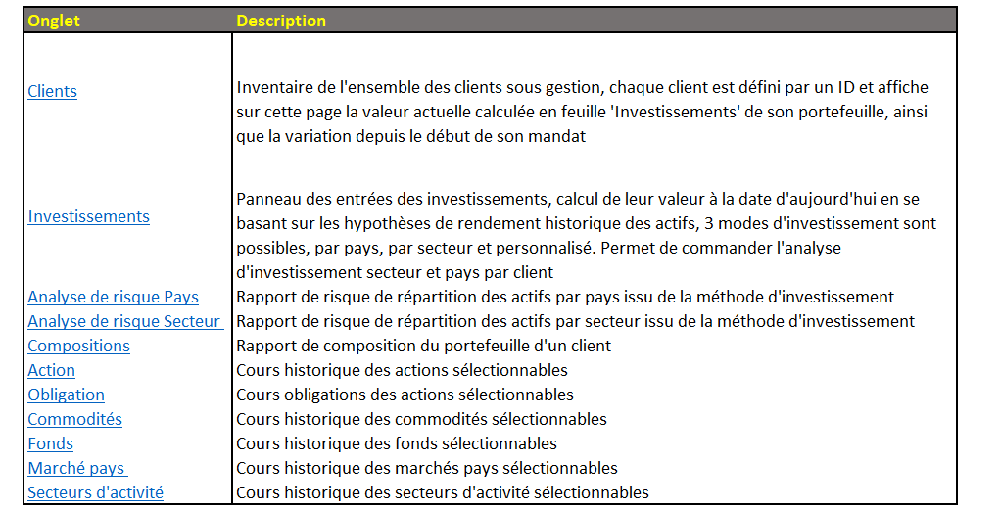
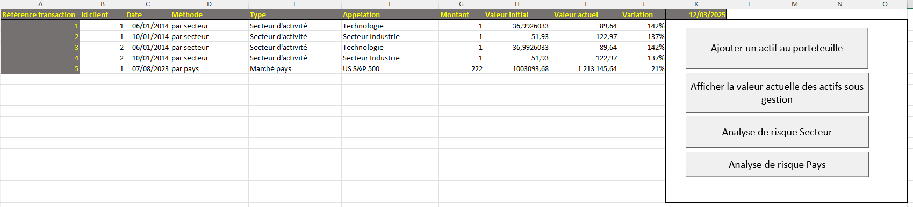
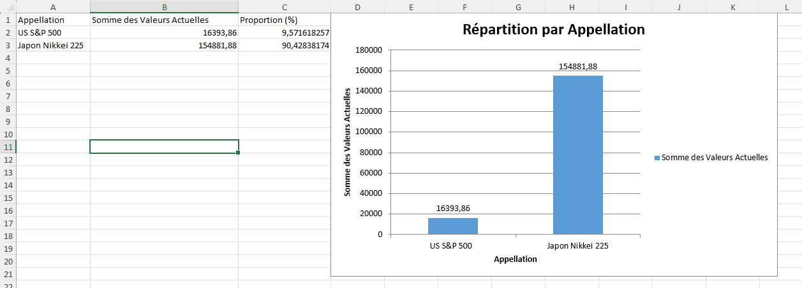
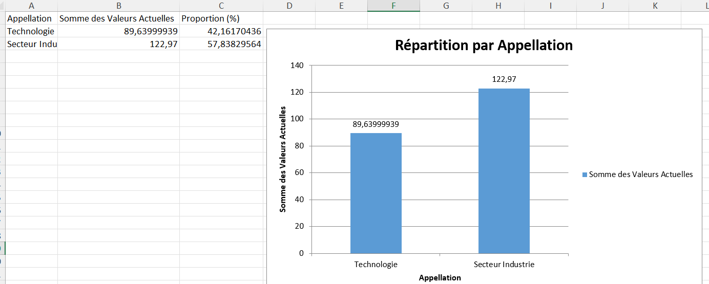
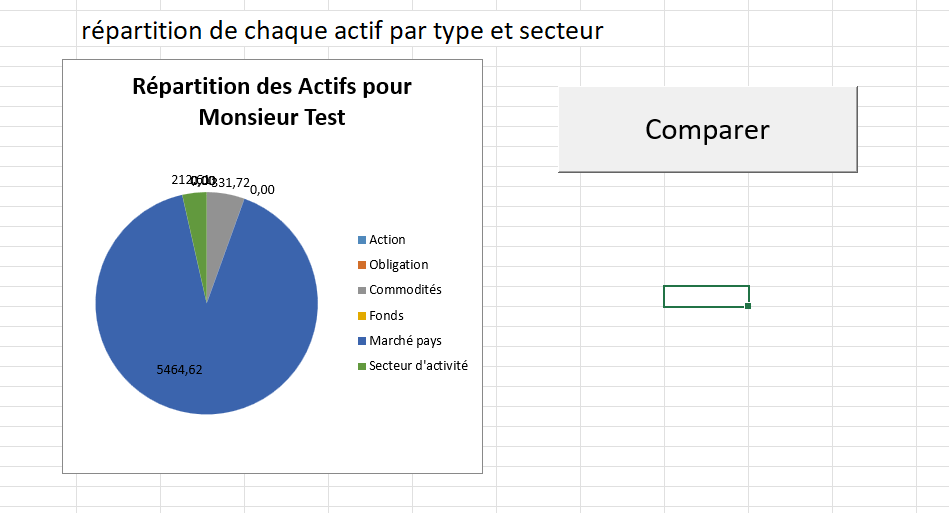
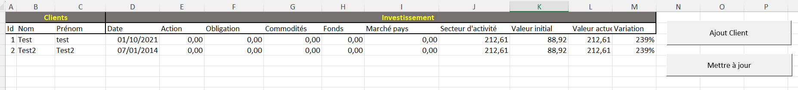

# Gestion de Portefeuille VBA 📊💼

Ce projet est une application développée en VBA permettant la gestion d'un portefeuille financier. Il inclut l'inventaire des clients, l'analyse des investissements, le suivi des actifs et des performances, ainsi que l'évaluation des risques par secteur et par pays.


🔗 **Accès à l'outil sur GitHub** : [Cliquez ici](outil_gestion_portefeuille.xlsm)

---
## 📌 Fonctionnalités principales
✅ **Suivi des clients** : Inventaire des clients avec leur portefeuille respectif.  
✅ **Gestion des investissements** : Enregistrement et calcul des valeurs actuelles des investissements.  
✅ **Analyse des risques** : Répartition des actifs par pays et par secteur.  
✅ **Optimisation du portefeuille** : Comparaison des actifs pour une meilleure diversification.  
✅ **Visualisation des performances** : Graphiques de répartition des investissements.  



---
## 📂 Explication des feuilles du projet
### 🏢 1. Clients
Cette feuille contient la liste des clients avec :
- **ID client** 📌
- **Nom et prénom** 🧑‍💼
- **Date d'inscription** 📅
- **Répartition des actifs** 📊 (actions, obligations, fonds, etc.)
- **Performance globale du portefeuille** 🚀

**🔹 Bouton disponible :** ➕ *Ajout d'un nouvel investissement*

```vba
Sub Ajout_invest()
    UserForm1.Show
End Sub
```


### 📈 2. Investissements
Cette feuille permet d’enregistrer et de suivre les investissements des clients selon :
- **Stratégies d'investissement** (par pays, par secteur, ou personnalisé) 🌍
- **Valeur initiale et valeur actuelle** 💰
- **Taux de variation** 📊

**🔹 Boutons disponibles :** 
- 🔄 *Mise à jour des valeurs* 
- 📊 *Comparaison des performances*

```vba
Sub Ajout_transac()
    UserForm3.Show
End Sub
```



### 🌎 3. Analyse de risque Pays
📌 Cette feuille présente une **analyse des risques par pays** sur la répartition des actifs des clients.

**🔹 Fonction principale :** Génération d’un **rapport de risque** en fonction des investissements effectués.  

```vba
Sub CalculerSommeParAppellationPays()
    ' Macro permettant de calculer la répartition par pays et de générer un graphique
End Sub
```



### 🏭 4. Analyse de risque Secteur
📌 Cette feuille évalue **l’exposition sectorielle du portefeuille** et permet d’optimiser la diversification des actifs.

```vba
Sub CalculerSommeParAppellationSecteur()
    ' Macro pour l'analyse sectorielle avec affichage graphique
End Sub
```



### 📊 5. Répartition des actifs
- **Graphique dynamique** de la répartition des actifs d'un client 📉
- Comparaison des allocations et performances des investissements 📊

**🔹 Bouton disponible :** 📈 *Comparer différents portefeuilles*

```vba
Sub Comparer_Portefeuilles()
    ' Fonction affichant un graphique comparatif des portefeuilles
End Sub
```



---
## ⚙️ Macros principales
### **1️⃣ Feuille Investissements**

🔹 **Ajout_transac** : Affiche un formulaire pour ajouter une transaction.  
🔹 **RemplirValeurActifEtDerniereValeur** : 
- Récupère les informations de l’investissement 📄
- Recherche la **valeur d'achat** et la **valeur actuelle** 💰
- Met à jour **les performances** en temps réel 📊

```vba
Sub RemplirValeurActifEtDerniereValeur()
    Dim wsInvestissements As Worksheet
    Set wsInvestissements = ThisWorkbook.Worksheets("Investissements")
    ' Code VBA pour récupérer et afficher les valeurs
End Sub
```

🔹 **CalculerSommeParAppellationPays** et **CalculerSommeParAppellationSecteur** :
- Regroupement des investissements **par pays** ou **par secteur** 🌍🏭
- Création d’un **rapport + graphique** 📊
- Détection des **risques de concentration** 🚨

### **2️⃣ Feuille Clients**

🔹 **Ajout_invest** : Affiche un formulaire pour ajouter un investissement.  
🔹 **Calcul_perf4** :
- Analyse les **performances de chaque client** 📈
- Récupère les **valeurs initiales et actuelles**
- Applique des **modèles spécifiques selon le type d’actif** (Action, Obligation, Fonds, etc.)




```vba
Sub Calcul_perf4()
    Dim A As Range
    Dim B As Range
    Set A = Worksheets("Clients").Range("A3")
    ' Analyse et calcul des performances
End Sub
```

🔹 **SommeValeursEtVariationsParType** :
- Calcule la **répartition totale des actifs** pour chaque client 📊
- Stocke les **variations de valeur** 💹

🔹 **TOUTENUN** :
- **Macro principale** qui regroupe toutes les analyses et met à jour les feuilles automatiquement 🚀

---
## 🛠️ **Utilisation**
1️⃣ Ajouter un client via la feuille **Clients**.  
2️⃣ Ajouter un investissement via **Investissements**.  
3️⃣ Exécuter les **macros d’analyse** 📈 : 
   - *Calcul_perf4* pour voir la performance du client.
   - *RemplirValeurActifEtDerniereValeur* pour actualiser les valeurs.
   - *CalculerSommeParAppellationPays* ou *Secteur* pour voir la répartition des actifs.
4️⃣ Comparer les performances avec les **graphes dynamiques** 📊.  
5️⃣ Optimiser la diversification et limiter les risques 🚨.  

---
📌 **Ce projet vise à simplifier la gestion et l'analyse d'un portefeuille en automatisant les calculs et les visualisations des performances financières**. 💼📊

👨‍💻 **Développé en VBA - Compatible Excel** 📊

